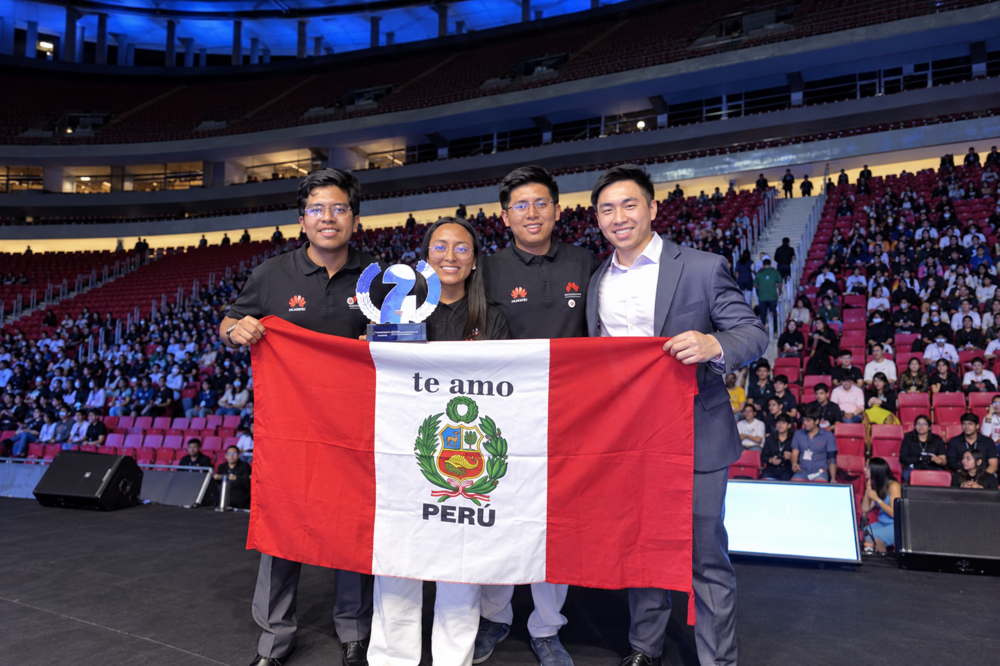
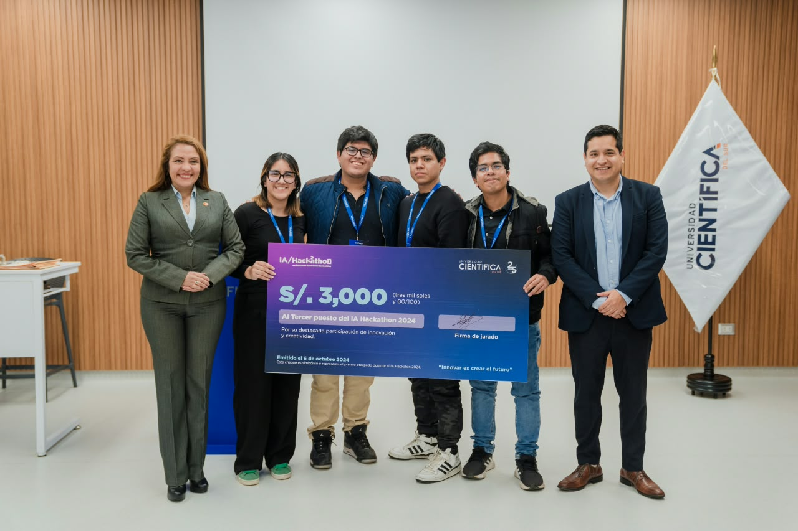
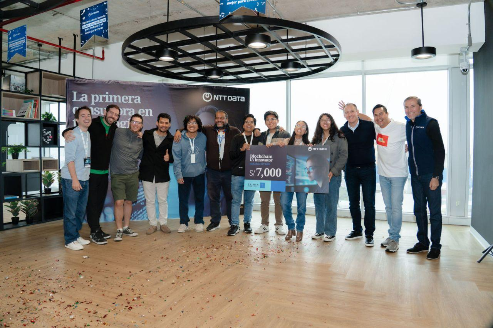
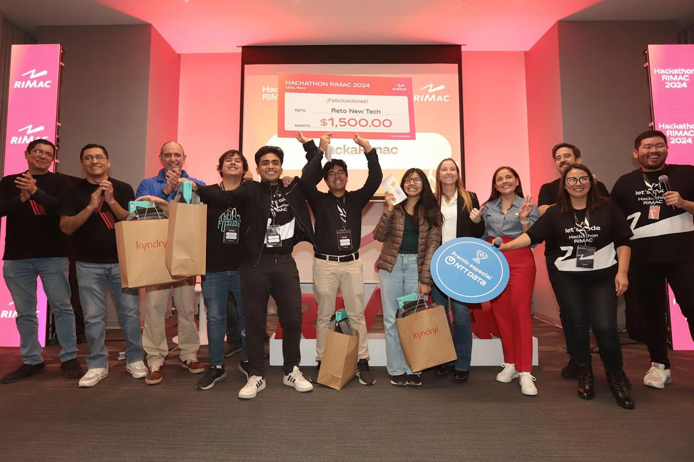

  <picture>
    <source media="(max-width: 760px) and (prefers-color-scheme: dark)" srcset="./assets/hero/agent-console-18cf1dfd-mobile-dark.svg">
    <source media="(max-width: 760px)" srcset="./assets/hero/agent-console-18cf1dfd-mobile-light.svg">
    <source media="(prefers-color-scheme: dark)" srcset="./assets/hero/agent-console-18cf1dfd-dark.svg">
    <source media="(prefers-color-scheme: light)" srcset="./assets/hero/agent-console-18cf1dfd-light.svg">
    
  </picture>

<h1 align="center">Cloud infrastructure that makes AI dependable.</h1>

  <strong>Cloud AI engineer</strong> · AI systems builder · Lima, Peru

  
  
  

## What I build

I design and ship **cloud-native AI systems** that turn models into reliable products: observable, secure, cost-aware, and useful in real workflows.

- 🧠 **Agentic & multimodal AI** — RAG, tool calling, multi-agent orchestration, and real-time voice and vision experiences with LangGraph, LiveKit, and modern model APIs.
- ☁️ **Cloud AI platforms** — production workloads across GCP, AWS, and Azure, from Cloud Run and serverless services to Kubernetes, private GPU inference, and edge-aware deployments.
- 🛡️ **Production engineering** — Terraform, GitHub Actions, GitOps, SRE, observability, security, load testing, and FinOps so AI systems can ship and stay healthy.
- 🔎 **Data & retrieval** — vector search, PostgreSQL, Redis, Neo4j, ETL/ELT, embeddings, and evaluation loops that give agents useful context.
- 🚀 **Builder mindset** — I like turning hard domains into clear products: voice assistants, local LLMs, sustainable-agriculture tools, insurance intelligence, and developer platforms.

My goal is simple: make advanced AI easier to operate, easier to trust, and easier for people to use.

## Cloud AI stack

<table>
  <tr>
    <td width="50%" valign="top">
      <strong>🧠 AI systems</strong> 
      Python · FastAPI · LangChain · LangGraph · RAG · OpenAI · Gemini · Claude · LiveKit · Whisper · YOLO · Ollama
    </td>
    <td width="50%" valign="top">
      <strong>☁️ Cloud & platform</strong> 
      GCP · AWS · Azure · Huawei Cloud · Cloud Run · Kubernetes · Terraform · Docker · GitHub Actions · Linux
    </td>
  </tr>
  <tr>
    <td width="50%" valign="top">
      <strong>🔎 Data & retrieval</strong> 
      PostgreSQL · Redis · Neo4j · Redshift · Azure AI Search · Pinecone · Milvus · embeddings · evaluation
    </td>
    <td width="50%" valign="top">
      <strong>🛡️ Reliability & delivery</strong> 
      SRE · MLOps · IaC · GitOps · observability · Prometheus · Grafana · SonarQube · load testing · FinOps
    </td>
  </tr>
</table>

  

## Selected systems

| System | What it proves | Stack |
| --- | --- | --- |
| **[GEMA · Metabolic Digital Twin](https://github.com/FransuaLeonSanchez/gema-metabolic-twin)** · [live app](https://gemelo-digital.vercel.app/) | Metabolic digital twin for early-risk screening in Peru, combining an interpretable ICM, ML predictions, and actionable what-if guidance. “Your health is a gem.” | Next.js, React, TypeScript, Gemini, Random Forest, Gradient Boosting, Tailwind, Vercel |
| **[GenIA Voice RAG](https://github.com/FransuaLeonSanchez/AI-ENGINEER-CASO-Fransua-Mijail-Leon-Sanchez)** · [live demo](https://genia.fransualeon.online) | Real-time voice assistant grounded in nearly 3,000 asset-management documents. | LiveKit, OpenAI, Azure AI Search, FastAPI, Next.js |
| **[HealthIA](https://github.com/FransuaLeonSanchez/HealthIA-AIHackathon)** | Bilingual multi-agent health workflows connected to wearable and IoT data. | LangGraph, Azure, OpenAI, FastAPI |
| **[RIMAC Alerts](https://github.com/FransuaLeonSanchez/HackaRIMAC)** | Award-winning serverless intelligence for proactive insurance engagement. | AWS Lambda, DynamoDB, Bedrock, Claude |

## Recent wins & recognition

<table>
  <tr>
    <td width="50%" align="center">
       
      <strong>🥈 2nd Place · Huawei LATAM 2025</strong> 
      IntiTerra · Huawei Developer Competition LATAM
    </td>
    <td width="50%" align="center">
       
      <strong>🥉 3rd Place · IA Hackathon 2024</strong> 
      “Buscando soluciones sostenibles” · Universidad Científica
    </td>
  </tr>
  <tr>
    <td width="50%" align="center">
       
      <strong>🥇 1st Place · NTT DATA 2025</strong> 
      IziContract — blockchain and AI for digital contracts
    </td>
    <td width="50%" align="center">
       
      <strong>🏆 Winner · RIMAC Hackathon 2024</strong> 
      New Tech challenge — real-time accident intelligence
    </td>
  </tr>
</table>

- 🥈 **2nd Place** — FIIS Project Fair and Competition 2026, Universidad Nacional de Ingeniería.
- 🥈 **2nd Place** — Huawei Developer Competition LATAM 2025, with **IntiTerra**.
- 🥈 **2nd Place** — HackaIzi by Izipay 2025, with **IziMetrics**.
- 🥇 **1st Place** — NTT DATA Blockchain & AI Innovator Hackathon 2025, with **IziContract**.
- 🥉 **3rd Place** — Huawei Developer Competition LATAM 2024, with **AIvendo**.
- 🏅 **International finalist** — LLM Hackathon 2024, **Top 10 among 150 teams**, with **VirtualSellers**.
- 🥇 **1st Place** — Tecsup Citizen Security Technology Hackathon 2024, with **Perú Seguro**.
- 🥉 **3rd Place** — Sustainable AI Hackathon 2024, with **Aprendo**.
- 🥈 **2nd Place** — FIIS Project Fair and Competition 2024-I.
- 🏆 **Winner** — RIMAC Hackathon 2024, New Tech challenge.

<a href="https://www.linkedin.com/in/fransua-leon/details/honors/">See the complete honors record on LinkedIn →</a>

  <picture>
    <source media="(prefers-color-scheme: dark)" srcset="https://raw.githubusercontent.com/FransuaLeonSanchez/FransuaLeonSanchez/output/galaga-contribution-graph-dark.svg">
    
  </picture>

  <strong>Open to building reliable Cloud AI systems with teams that care about production quality.</strong> 
  <a href="mailto:fransualeon2004@gmail.com">fransualeon2004@gmail.com</a> · <a href="https://www.linkedin.com/in/fransua-leon/">Let's connect on LinkedIn</a>

---
