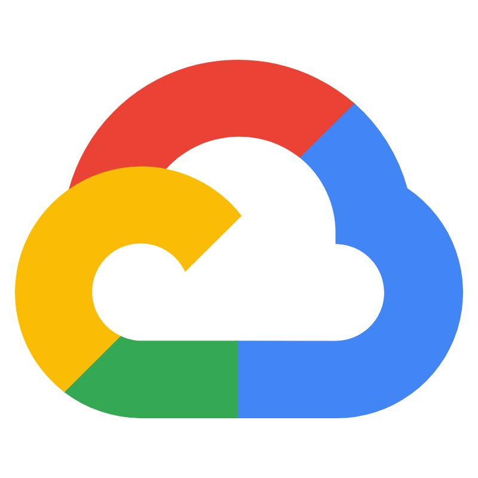

  <picture>
    <source media="(max-width: 760px) and (prefers-color-scheme: dark)" srcset="./assets/hero/agent-console-112d89d2-mobile-dark.svg">
    <source media="(max-width: 760px)" srcset="./assets/hero/agent-console-112d89d2-mobile-light.svg">
    <source media="(prefers-color-scheme: dark)" srcset="./assets/hero/agent-console-112d89d2-dark.svg">
    <source media="(prefers-color-scheme: light)" srcset="./assets/hero/agent-console-112d89d2-light.svg">
    
  </picture>

<h1 align="center">Cloud infrastructure that makes AI dependable.</h1>

  <strong>Ssr. Cloud Engineer @ Alicorp</strong> · AI systems builder · Lima, Peru

  
  
  

## What I build

I turn AI prototypes into **secure, observable, cost-aware production systems**. My work connects cloud architecture, platform engineering, MLOps, SRE, and agentic AI.

- **At Alicorp:** GCP governance, reliability, FinOps, Terraform, and CI/CD automation.
- **Agentic AI:** RAG, tool use, multi-agent orchestration, and real-time voice experiences.
- **Cloud platforms:** production workloads across Google Cloud, AWS, and Azure.
- **Operational mindset:** infrastructure as code, observability, security, and measurable delivery.

<table>
  <tr>
    <td width="33%" align="center">
       
      <strong>Cloud Platforms</strong> 
      GCP · AWS · Azure
    </td>
    <td width="33%" align="center">
       
      <strong>AI Systems</strong> 
      Agents · RAG · Multimodal
    </td>
    <td width="33%" align="center">
       
      <strong>Platform Engineering</strong> 
      IaC · SRE · MLOps
    </td>
  </tr>
</table>

## Cloud AI stack

  

**AI & agents** · LangChain · LangGraph · RAG · LiveKit · OpenAI · Gemini · Claude · Ollama · Whisper · YOLO

**Data & search** · PostgreSQL · Redis · Neo4j · SQL Server · Redshift · Azure AI Search · Pinecone · Milvus

**Platform & operations** · Terraform · Docker · Kubernetes · GitHub Actions · GitOps · Prometheus · Grafana · SonarQube

## Selected systems

| System | What it proves | Stack |
| --- | --- | --- |
| **[GenIA Voice RAG](https://github.com/FransuaLeonSanchez/AI-ENGINEER-CASO-Fransua-Mijail-Leon-Sanchez)** · [live demo](https://genia.fransualeon.online) | Real-time voice assistant grounded in nearly 3,000 asset-management documents. | LiveKit, OpenAI, Azure AI Search, FastAPI, Next.js |
| **[Local LLM Lab](https://github.com/FransuaLeonSanchez/Intel-B60-LLM-Chatbot)** | Private, containerized local-model inference with GPU acceleration and a usable web interface. | Ollama, Vulkan, Qwen, FastAPI, Docker |
| **[HealthIA](https://github.com/FransuaLeonSanchez/HealthIA-AIHackathon)** | Bilingual multi-agent health workflows connected to wearable and IoT data. | LangGraph, Azure, OpenAI, FastAPI |
| **[RIMAC Alerts](https://github.com/FransuaLeonSanchez/HackaRIMAC)** | Award-winning serverless intelligence for proactive insurance engagement. | AWS Lambda, DynamoDB, Bedrock, Claude |

## Experience signal

| Period | Role | Scope |
| --- | --- | --- |
| **2026—Now** | **Ssr. Cloud Engineer · Alicorp** | Cloud governance, SRE, FinOps, Terraform, and GitHub Actions on GCP. |
| **2025—2026** | **Cloud AI Engineer · Attach** | Multi-cloud AI infrastructure, secure Cloud Run delivery, multimodal agents, and IaC. |
| **2024—2025** | **Software AI Engineer · YaVendió** | LangChain/LangGraph agents, RAG, Redis, cloud integrations, and performance engineering. |
| **2023—2024** | **Software Developer · Kybalion** | Speech AI, local LLMs, computer vision, knowledge graphs, and Dockerized services. |
| **2023** | **Data Engineering Intern · Nerdic Tech** | Go, AWS, ETL/ELT, and Redshift pipelines. |

## Education, languages & recognition

- **Systems Engineering** — Universidad Nacional de Ingeniería (UNI), Peru.
- **Artificial Intelligence major** — Hanyang Cyber University, South Korea.
- **Languages:** Spanish — native · English — C1 advanced.
- **Recognition:** 2nd place, Huawei Developer Competition LATAM 2025 · Winner, RIMAC Hackathon 2024 · 1st place, NTT DATA Blockchain & AI Innovator 2025 · 1st place, Tecsup Security Challenge.

## Contribution arcade

  <picture>
    <source media="(prefers-color-scheme: dark)" srcset="https://raw.githubusercontent.com/FransuaLeonSanchez/FransuaLeonSanchez/output/galaga-contribution-graph-dark.svg">
    
  </picture>

  <strong>Open to building reliable Cloud AI systems with teams that care about production quality.</strong> 
  <a href="https://www.linkedin.com/in/fransua-leon/">Let's connect on LinkedIn</a>

---

Terminal hero adapted from the MIT-licensed <a href="https://github.com/wildanniam/GitHub-Profile-Console">GitHub Profile Console</a>. Contribution arcade powered by <a href="https://github.com/abozanona/pacman-contribution-graph">pacman-contribution-graph</a>.
